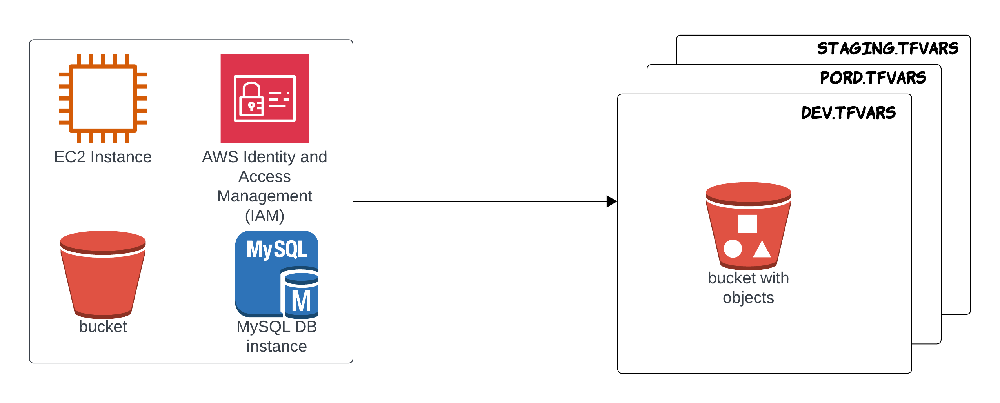

# TERRAFORM-AWS-ENV

This repository provides an organized and modular Terraform configuration for provisioning AWS infrastructure environments. It supports multiple environments (`dev`, `staging`, and `prod`) and includes reusable modules for common AWS resources like EC2, IAM, RDS, and VPC.

---

## 🌍 Environments

The infrastructure is environment-specific, allowing separate configurations for:

- `dev.tfvars` – Development environment
- `prod.tfvars` – Production environment
- `staging.tfvars` – Staging environment

---


## 📊 Architecture Diagram



---

## 📦 Module Structure

Reusable infrastructure modules are located under the `modules/` directory:

* `ec2/` – Defines and provisions EC2 instances
* `iam/` – Manages IAM roles, policies, and users
* `rds/` – Provisions and manages RDS instances
* `vpc/` – Creates and manages VPCs, subnets, route tables, and gateways

Each module is self-contained and can be reused across different environments.

---

## 📁 Terraform Root Files

* `main.tf` – Entry point where all modules and resources are called
* `backend.tf` – Configures remote state backend (e.g., S3 with DynamoDB for state locking)
* `variable.tf` – Declares all input variables used in the configuration

---

## 🚀 Getting Started

### Initialize Terraform

```bash
terraform init
```

### Validate the configuration

```bash
terraform validate
```

### Create Workspace

```bash
terraform new workspace dev
```

### Plan the deployment

```bash
terraform plan -var-file="dev.tfvars"
```

### Apply the configuration

```bash
terraform apply -var-file="dev.tfvars"
```

---

## 🔐 Remote State

Make sure the `backend.tf` is correctly configured to use:

* **S3** – For storing the Terraform state file
* **DynamoDB** – For state locking and consistency during concurrent operations

This is critical for team-based infrastructure management.

---

